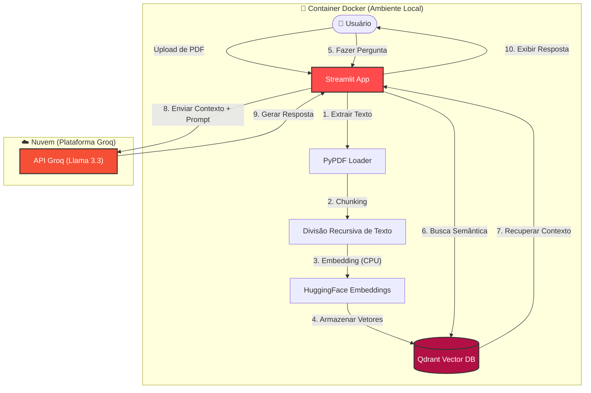

# 🧠 DocuMind: RAG Inteligente com Docker & Groq

<div align="center">


**Uma aplicação de RAG (Retrieval-Augmented Generation) focada em privacidade e alta performance.**
*Combina a segurança dos embeddings locais com a velocidade extrema da inferência via LPU da Groq.*

[Reportar Bug](https://github.com/SEU-USUARIO/DocuMind/issues) · [Solicitar Feature](https://github.com/SEU-USUARIO/DocuMind/issues)

</div>

---

## 📖 Sobre o Projeto

Na era da IA Generativa, **Alucinações** são um problema crítico. Modelos base frequentemente inventam fatos quando não possuem contexto específico.

O **DocuMind** resolve isso baseando as respostas da IA nos *seus* documentos. Ele permite que você converse com seus PDFs usando uma arquitetura híbrida projetada para otimizar **Custo**, **Privacidade** e **Performance**.

### Por que Híbrido?
*   **Embeddings Locais (Privacidade & Custo):** O entendimento semântico e a vetorização acontecem 100% localmente na sua CPU usando modelos da HuggingFace. O texto completo do seu documento *nunca* é enviado para uma API de embeddings externa, economizando custos e aumentando a privacidade dos dados.
*   **Inferência na Nuvem (Velocidade):** A geração da resposta é delegada à LPU (Unidade de Processamento de Linguagem) da Groq, rodando o **Llama 3.3 (70b-versatile)**. Isso entrega respostas a centenas de tokens por segundo, parecendo instantâneo para o usuário.

---

## 🏗️ Arquitetura

O sistema segue um pipeline clássico de **RAG**, totalmente conteinerizado para reprodutibilidade.



---

## 🚀 Principais Funcionalidades

*   **🐳 Totalmente Dockerizado:** "Escreva uma vez, execute em qualquer lugar". Toda a stack (App + Vector DB) roda em containers orquestrados. Nenhuma configuração complexa de ambiente Python é necessária.
*   **🧠 Chunking Avançado:** Implementa `RecursiveCharacterTextSplitter` com sobreposição (overlap) para manter o contexto semântico entre quebras de documento.
*   **⚡ Integração com Groq LPU:** Tira proveito do motor de inferência mais rápido do mundo para respostas de LLM quase instantâneas.
*   **🔍 Busca Semântica:** Utiliza **Qdrant**, um motor de busca vetorial de alta performance feito sob medida para aplicações de IA.
*   **🛡️ Credenciais Seguras:** Gerenciamento estrito de chaves de API via arquivos `.env`, garantindo que nenhum segredo seja hardcoded.

---

## 🛠️ Tech Stack

### Frontend & Lógica da Aplicação
*   **[Streamlit](https://streamlit.io/):** Para desenvolvimento rápido de aplicações de dados interativas.
*   **[Python 3.9](https://www.python.org/):** Linguagem de programação principal.

### IA & Engenharia de Dados
*   **[LangChain](https://www.langchain.com/):** Framework para orquestração e encadeamento.
*   **[HuggingFace](https://huggingface.co/):** `sentence-transformers/all-MiniLM-L6-v2` para embeddings locais eficientes.
*   **[Qdrant](https://qdrant.tech/):** Banco de dados vetorial de alta performance (rodando em um container separado).
*   **[Groq](https://groq.com/):** Para inferência de LLM usando Llama 3.3.

### DevOps & Infraestrutura
*   **[Docker & Docker Compose](https://www.docker.com/):** Conteinerização e orquestração de serviços.

---

## 📋 Pré-requisitos

O único requisito é o **Docker**. Você *não* precisa de Python ou Node.js instalados na sua máquina.

*   [Docker Desktop](https://www.docker.com/products/docker-desktop/) (Windows/Mac) ou [Docker Engine](https://docs.docker.com/engine/install/) (Linux)

---

## 🔧 Instalação e Uso

### 1. Clone o Repositório
```bash
git clone https://github.com/SEU-USUARIO/DocuMind.git
cd DocuMind
```

### 2. Configure as Variáveis de Ambiente
Crie um arquivo `.env` no diretório raiz. Este arquivo é ignorado pelo Git por segurança.

```bash
# Copie o arquivo de exemplo
cp .env.example .env
```

Abra o `.env` e adicione sua Chave de API da Groq (obtenha gratuitamente em [console.groq.com](https://console.groq.com)):

```ini
GROQ_API_KEY=gsk_sua_chave_super_secreta_aqui
QDRANT_HOST=qdrant
```

### 3. Execute com Docker Compose
Construa e inicie os serviços. Isso pode levar alguns minutos na primeira vez para baixar os pesos do modelo.

```bash
docker compose up --build
```

### 4. Acesse o App
Abra seu navegador e navegue para:
👉 **[http://localhost:8501](http://localhost:8501)**

---

## 📂 Estrutura do Projeto

```text
DocuMind/
├── 📄 app.py                # Aplicação principal Streamlit e lógica RAG
├── 🐳 docker-compose.yaml   # Orquestra os serviços App e Qdrant
├── 🐳 Dockerfile            # Define o ambiente para o app Python
├── 📦 requirements.txt      # Dependências Python
├── ⚙️ .env                  # Chaves de API (Não versionado)
├── 📄 .env.example          # Modelo para variáveis de ambiente
└── 📝 README.md             # Documentação do projeto
```

---

## 🧠 Por "Baixo do Capô"

Veja como o processo de **Recuperação (Retrieval)** funciona no código (`app.py`):

1.  **Ingestão:** O PDF é carregado e dividido em pedaços (chunks) de 1000 caracteres com 200 de sobreposição.
2.  **Embedding:** Cada pedaço é convertido em um vetor denso usando o modelo `HuggingFaceEmbeddings`.
3.  **Indexação:** Esses vetores são armazenados no banco de dados Qdrant.
4.  **Consulta:** Quando você faz uma pergunta, ela também é vetorizada. Realizamos uma *Busca de Similaridade por Cosseno* para encontrar os 3 trechos mais relevantes.
5.  **Geração:** Esses trechos são alimentados no prompt de sistema do modelo Llama 3.3 na Groq:

```python
# Representação Simplificada da Lógica
prompt = f"""
Use o contexto abaixo para responder a pergunta.
CONTEXTO: {chunks_recuperados}
PERGUNTA: {consulta_usuario}
"""
resposta = groq_llm.invoke(prompt)
```

---

## 🗺️ Roadmap (Próximos Passos)

- [ ] Adicionar suporte para upload de múltiplos PDFs simultaneamente.
- [ ] Implementar Histórico de Chat (Memória) para a IA lembrar do contexto.
- [ ] Adicionar opção para alternar entre diferentes LLMs (ex: Mixtral, Gemma).
- [ ] Deploy na nuvem (AWS/GCP/Streamlit Cloud).

---

## 📄 Licença

Distribuído sob a licença MIT. Veja `LICENSE` para mais informações.

---

## 👤 Autor

**Itagiba Neto**
*   **Cientista de Dados** | **Engenheiro de Machine Learning**
*   [LinkedIn](https://linkedin.com/in/itagiba-neto)

---

<p align="center">
  <i>Desenvolvido com ❤️ usando Streamlit e Groq.</i>
</p>